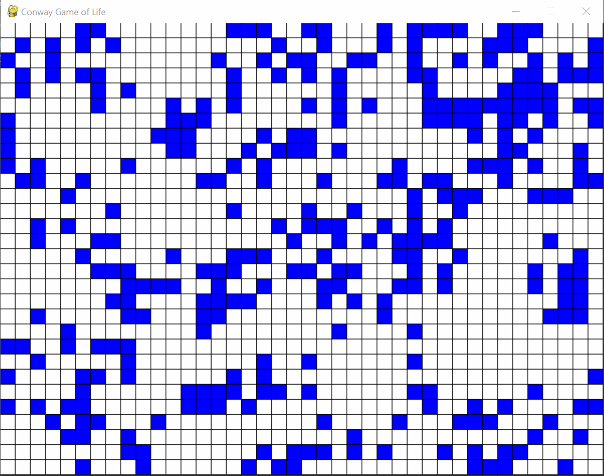

<h1 align="center">
   
  Conway's Game of Life
   
</h1>

<h4 align="center">Game of Life de Conway feito usando Python, Pygame e Numpy.</h4>
 

Game of Life é um jogo sem jogador criado por John Horton Conway que simula processos de evolução de células biológicas. É o exemplo mais bem conhecido de [autómato celular](https://pt.wikipedia.org/wiki/Aut%C3%B3mato_celular).

 

Comecei a criar este jogo para entender mais sobre a simulação de particulas em jogos, já que essas geralmente utilizam do autómato celular. No inicio comecei usando C++, mas resolvi mudar para Python.

 

## 📝 Mais Informações

> 🚩 Links do Wikipedia

1. [Regras](https://pt.wikipedia.org/wiki/Jogo_da_vida#Regras_do_Jogo_da_Vida)

2. [Origem](https://pt.wikipedia.org/wiki/Jogo_da_vida#Origem)

3. [Sobre](https://pt.wikipedia.org/wiki/Jogo_da_vida#O_Jogo)

 

## 👨‍🏫 Testando

> 🚩 Foi utilizado o Python 3.9.1 (64 Bits)

Só executar o arquivo main.py
